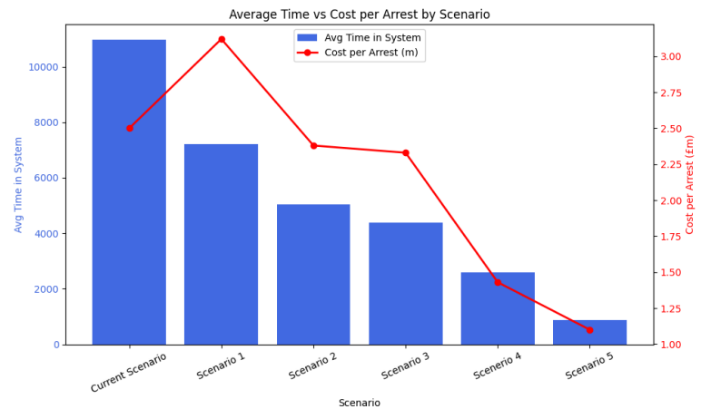

# 🧬🔍 Forensics Process Optimization using Simul8, Excel, and Python

This project simulates and analyzes DNA forensics processes for West Yorkshire Police to identify the most cost-effective operational setup for delivering results within a 48-hour window. The study was part of the MANM304 Operational Analytics module at the University of Surrey (2025 cohort).

## 🎯 Objective
To model and compare different forensics process configurations using discrete-event simulation and perform ROI analysis to support strategic decision-making for Rapid DNA implementation.

## 🧰 Tools Used
- **Simul8** – to simulate the current and proposed forensic process scenarios.
- **Excel** – to generate and organize datasets from Simul8 output (5,000 trials).
- **AtRisk (Palisade)** – to conduct Monte Carlo simulations and compute ROI estimates.
- **Jupyter Notebook (Python)** – to perform sensitivity analysis and visualize queueing distributions.

## 📁 Project Structure

- `data/` – Excel datasets exported from Simul8 (e.g. queue times, distributions)
- `simulate_models/` – Simul8 `.s8` models for current process and 5 Rapid DNA scenarios
- `visualizations/` – Jupyter notebook and plots for queue distributions and sensitivity analysis
- `reports/` – Final group presentation (PDF)

## 📊 Scenarios Modeled
Six scenarios were developed and compared:
1. **Current process**
2. **Rapid DNA machine**
3. **Rapid DNA + courier**
4. **Rapid DNA + 24hr CSI**
5. **Rapid DNA + 24hr lab**
6. **Full 24/7 operation (CSI + lab)**

Each scenario was implemented as a Simul8 model and run for **5,000 trials** to ensure statistical convergence and robustness. For every completed simulation run, detailed sample-level data was exported into Excel.

## 📈 Key Analyses

- **Sample-Level Breakdown**: For each individual sample processed through the system, we recorded:
  - Time spent in each **queue**
  - Time spent in each **activity**
  - **Total time in queues**, **total time in activities**, and **overall time in system**

- **Simulation Metrics**: Aggregated statistics across 5,000 trials for each scenario, including min, max, mean, and 95% confidence intervals.

- **Queue Distributions**: Visualized using Python (Jupyter Notebook) to assess delays at each stage. Subplots were used with consistent axes to enable comparison across scenarios.

- **Sensitivity Analysis**: Conducted using both correlation-based tornado plots and parameter sweep spider plots to identify which process stages most influenced system delays.

- **ROI Analysis**:
  - ROI = Arrests per £m spent
  - Calculated using **AtRisk** in Excel, with the arrest probability modeled as a function of delay using the given objective function curve
  - Monte Carlo simulation used to estimate ROI distributions based on sample processing time variability

## 💡 Findings
- Scenario 6 (full 24/7 CSI and lab operation) had the highest arrest potential but also the highest cost.
- Scenario 4 and 5 offered strong cost-benefit trade-offs and consistently higher probabilities of meeting the 48-hour deadline.
- Main delays in early scenarios were caused by the batching schedule of the DNA sequencer and limited CSI shift availability.
- Queueing bottlenecks were clearly revealed through queue distribution plots and contributed heavily to extended processing times.
- Sensitivity analysis confirmed that transport time, validation availability, and CSI coverage had the greatest impact on reducing total system time.

## 📌 Conclusion
This project highlights the value of simulation modeling in operational analytics. By replicating realistic queue-based DNA processing systems and analyzing the effects of new technologies and scheduling strategies, we offer evidence-based recommendations for improving turnaround time and optimizing cost-effectiveness in law enforcement forensics.




## 🖥️ Requirements (for Jupyter Visualizations)
Install dependencies with:

```bash
pip install pandas matplotlib seaborn
